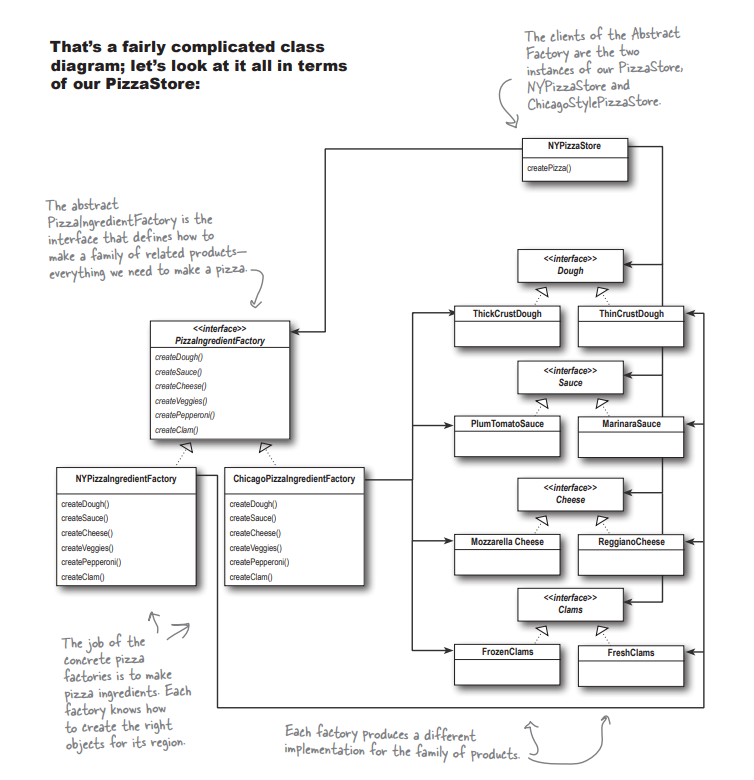
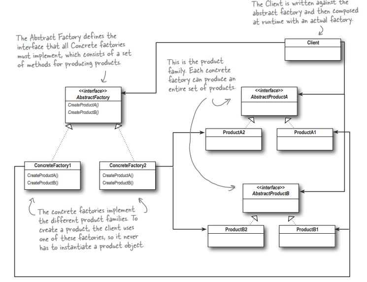
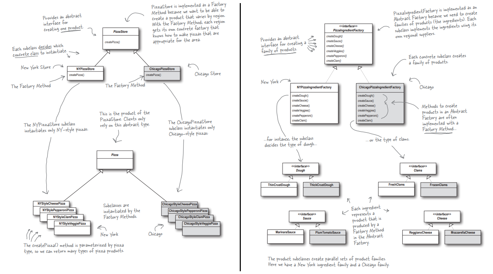

# Abstract Factory pattern

This folder contains an example of `Abstract Factory pattern` - through the example of an Pizza ingredients factory example.

The Abstract Factory Pattern provides an interface for creating families of related or dependent objects without specifying their concrete classes.

Abstract Factory allows a client to use an abstract interface to create a set of related products without knowing (or caring) about the concrete products that are actually produced. In this way, the client is decoupled from any of the specifics of the concrete products.

Often the methods of an Abstract Factory are implemented as factory methods. It makes sense, right? The job of an Abstract Factory is to define an interface for creating a set of products. Each method in that interface is responsible for creating a concrete product, and we implement a subclass of the Abstract Factory to supply those implementations. So, factory methods are a natural way to 
implement your product methods in your abstract factories.

### How factory and abstract factory co-exist in this example:

(Pizza store is a Factory and ingredients factory is an abstract factory)

> Output of the code:

--- Making a New York Style Cheese Pizza ---
Preparing New York Style Cheese Pizza
Bake for 25 minutes at 350
Cutting the pizza into diagonal slices
Place pizza in official PizzaStore box
Ethan ordered a ---- New York Style Cheese Pizza ----
Thin Crust Dough
Marinara Sauce
Reggiano Cheese

--- Making a Chicago Style Cheese Pizza ---
Preparing Chicago Style Cheese Pizza
Bake for 25 minutes at 350
Cutting the pizza into diagonal slices
Place pizza in official PizzaStore box
Joel ordered a ---- Chicago Style Cheese Pizza ----
ThickCrust style extra thick crust dough
Tomato sauce with plum tomatoes
Shredded Mozzarella

--- Making a New York Style Clam Pizza ---
Preparing New York Style Clam Pizza
Bake for 25 minutes at 350
Cutting the pizza into diagonal slices
Place pizza in official PizzaStore box
Ethan ordered a ---- New York Style Clam Pizza ----
Thin Crust Dough
Marinara Sauce
Reggiano Cheese
Fresh Clams from Long Island Sound

--- Making a Chicago Style Clam Pizza ---
Preparing Chicago Style Clam Pizza
Bake for 25 minutes at 350
Cutting the pizza into diagonal slices
Place pizza in official PizzaStore box
Joel ordered a ---- Chicago Style Clam Pizza ----
ThickCrust style extra thick crust dough
Tomato sauce with plum tomatoes
Shredded Mozzarella
Frozen Clams from Chesapeake Bay

--- Making a New York Style Pepperoni Pizza ---
Preparing New York Style Pepperoni Pizza
Bake for 25 minutes at 350
Cutting the pizza into diagonal slices
Place pizza in official PizzaStore box
Ethan ordered a ---- New York Style Pepperoni Pizza ----
Thin Crust Dough
Marinara Sauce
Reggiano Cheese
Garlic, Onion, Mushrooms, Red Pepper
Sliced Pepperoni

--- Making a Chicago Style Pepperoni Pizza ---
Preparing Chicago Style Pepperoni Pizza
Bake for 25 minutes at 350
Cutting the pizza into diagonal slices
Place pizza in official PizzaStore box
Joel ordered a ---- Chicago Style Pepperoni Pizza ----
ThickCrust style extra thick crust dough
Tomato sauce with plum tomatoes
Shredded Mozzarella
Black Olives, Spinach, Eggplant
Sliced Pepperoni

--- Making a New York Style Veggie Pizza ---
Preparing New York Style Veggie Pizza
Bake for 25 minutes at 350
Cutting the pizza into diagonal slices
Place pizza in official PizzaStore box
Ethan ordered a ---- New York Style Veggie Pizza ----
Thin Crust Dough
Marinara Sauce
Reggiano Cheese
Garlic, Onion, Mushrooms, Red Pepper

--- Making a Chicago Style Veggie Pizza ---
Preparing Chicago Style Veggie Pizza
Bake for 25 minutes at 350
Cutting the pizza into diagonal slices
Place pizza in official PizzaStore box
Joel ordered a ---- Chicago Style Veggie Pizza ----
ThickCrust style extra thick crust dough
Tomato sauce with plum tomatoes
Shredded Mozzarella
Black Olives, Spinach, Eggplant

