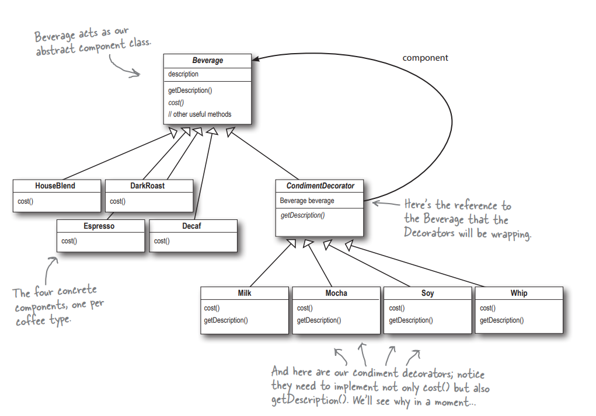
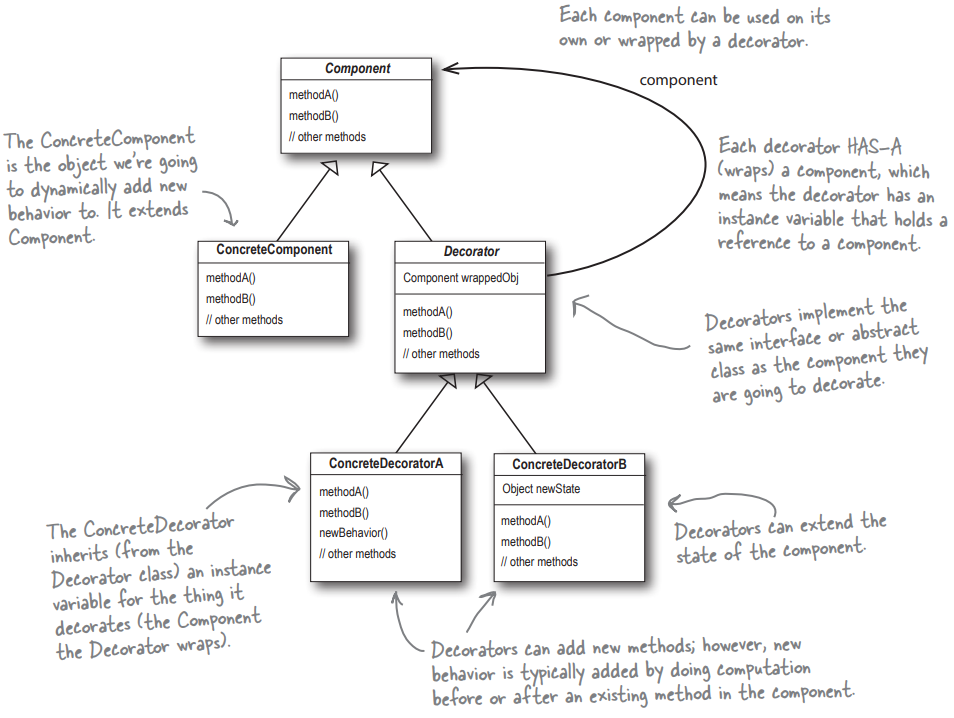

# Decorator pattern

This folder contains an example of `decorator pattern` - through the example of an coffeehouse.

Decorators attach additional responsibilities to objects dynamically. Decorators provide a flexible alternative to subclassing for extending functionality.





> Output of the code:

```
TALL Espresso $1.99
TALL Dark Roast Coffee, Mocha, Whip $1.29
GRANDE House Blend Coffee, Soy, Mocha, Whip $1.3900000000000001
VENTI House Blend Coffee, Soy, double Mocha, Whip $1.5900000000000003
```