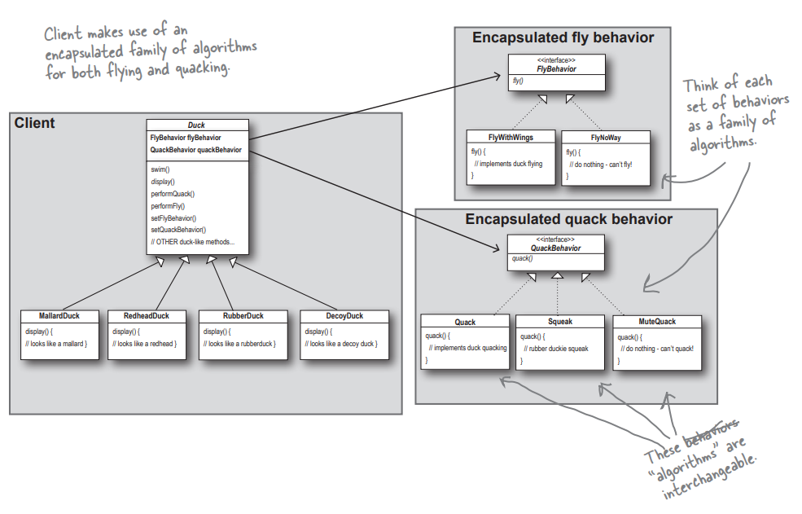
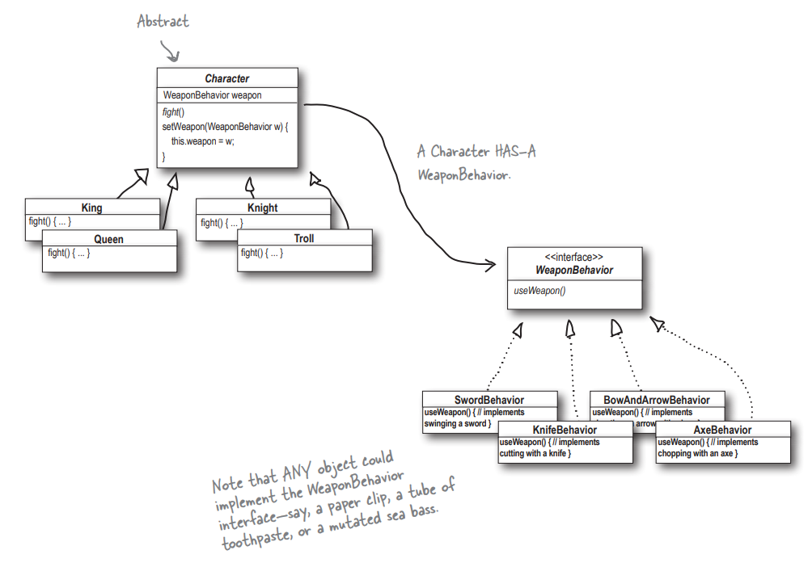

# Strategy pattern

This folder contains an example of `strategy pattern` - through the example of an abstract class of ducks.

The Strategy Pattern defines a family of algorithms, encapsulates each one, and makes them interchangeable. Strategy lets the algorithm vary independently from clients that use it





> Output of the code:

```
I'm a real Mallard duck
Quack!!
I'm flying with wings!!
I'm a Rubber duck
Squeak!!
I cannot fly!!
```
