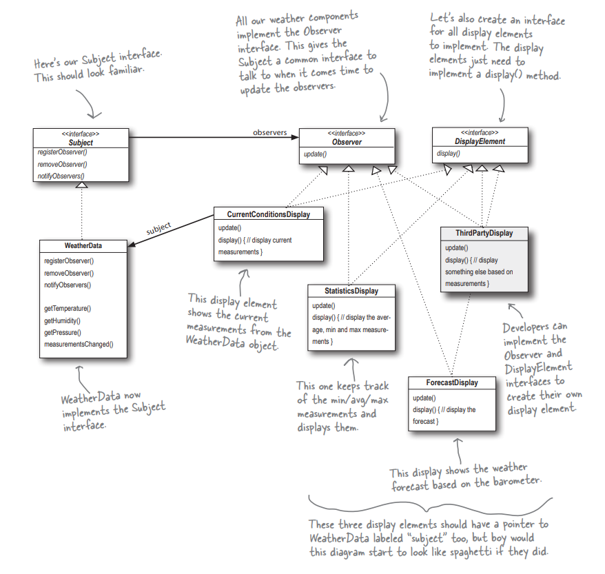
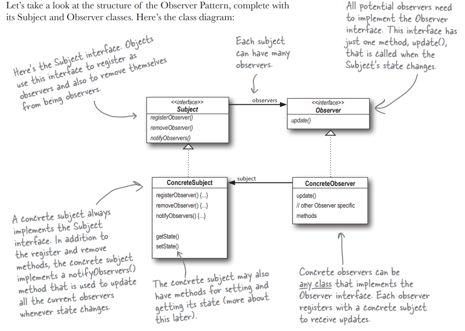

# Observer pattern

This folder contains an example of `Observer pattern` - through the example of an observer-oberservable model of a weather station and weather reporting displays.

The Observer Pattern defines a one-to-many dependency between objects so that when one object changes state, all its dependents are notified and updated automatically





> Output of the code:

```
Current conditions: 80.0F degrees and 65.0% humidity
Avg/Max/Min temperature = 80.0/80.0/80.0
Forecast: Improving weather on the way!
Heat index is 82.95535
Current conditions: 82.0F degrees and 70.0% humidity
Avg/Max/Min temperature = 81.0/82.0/80.0
Forecast: Watch out for cooler, rainy weather
Heat index is 86.90124
Current conditions: 78.0F degrees and 90.0% humidity
Avg/Max/Min temperature = 80.0/82.0/78.0
Heat index is 83.64967
Current conditions: 82.0F degrees and 70.0% humidity
Avg/Max/Min temperature = 80.5/82.0/78.0
Heat index is 86.90124
Current conditions: 82.0F degrees and 70.0% humidity
Avg/Max/Min temperature = 80.8/82.0/78.0
Heat index is 86.90124
Forecast: More of the same
Current conditions: 78.0F degrees and 90.0% humidity
Avg/Max/Min temperature = 80.333336/82.0/78.0
Heat index is 83.64967
Forecast: More of the same
```
