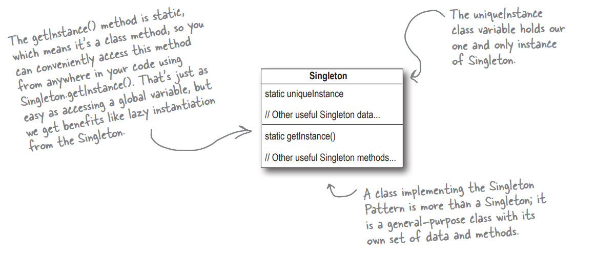

# Singleton pattern

This folder contains an example of `Singleton pattern` - through the example of an Chocolate boiler in a chocolate factory.

The Singleton Pattern ensures a class has only one instance, and provides a global point of access to it.



Here, we provide multiple implementations of the singleton pattern
 - Simple: this is not thread safe as the creation can happen multiple times if two threads are initialized at the same time which can possibly create multiple instances of the singleton object.
 - Synchronized
 - Eagerly Created
 - Enum
 - Double checked locking

> Output of the code:

```
-----------------------------------------------------------------------
SIMPLE BOILER
Creating unique instance of Chocolate Boiler
Returning instance of Chocolate Boiler
Filled the boiler with a milk/chocolate mixture
Returning instance of Chocolate Boiler
Boiled the contents to a boil
WARNING: Boiler already full!
Drained the boiled milk and chocolate
-----------------------------------------------------------------------
SYNCHRONIZED BOILER
Creating unique instance of Chocolate Boiler
Returning instance of Chocolate Boiler
Filled the boiler with a milk/chocolate mixture
Returning instance of Chocolate Boiler
Boiled the contents to a boil
WARNING: Boiler already full!
Drained the boiled milk and chocolate
-----------------------------------------------------------------------
EAGERLY CREATED BOILER
Filled the boiler with a milk/chocolate mixture
Boiled the contents to a boil
WARNING: Boiler already full!
Drained the boiled milk and chocolate
-----------------------------------------------------------------------
ENUM BOILER
Filled the boiler with a milk/chocolate mixture
Boiled the contents to a boil
WARNING: Boiler already full!
Drained the boiled milk and chocolate
-----------------------------------------------------------------------
DOUBLE CHECKED LOCKING BOILER
Creating unique instance of Chocolate Boiler
Returning instance of Chocolate Boiler
Filled the boiler with a milk/chocolate mixture
Returning instance of Chocolate Boiler
Boiled the contents to a boil
WARNING: Boiler already full!
Drained the boiled milk and chocolate
-----------------------------------------------------------------------

```